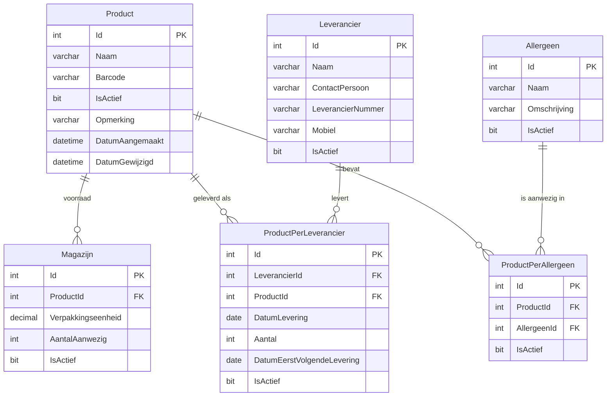

# Database Specificatie Tabel – Jamin

| | |
| --- | --- |
| Opdracht | BE-opdracht 01 – Jamin |
| Studentnummer | 344385 |
| Datum | 01-10-2026 |
| Database | `laravel` |
| Databasesysteem | MySQL / MariaDB, charset `utf8mb4`, collation `utf8mb4_unicode_ci` |
| Create-script | `create_script_jamin.sql` |
| Export | `db/BE-opdracht-1-344385_jamin.sql` |

## 1. Overzicht

De opdracht kent zes specificatietabellen. Voor beide user stories zijn alle zes nodig:

| Tabel | Soort | User story 1 – leveringsinformatie | User story 2 – allergeneninformatie |
| --- | --- | --- | --- |
| `Product` | stamtabel | ✔ | ✔ |
| `Leverancier` | stamtabel | ✔ | |
| `Magazijn` | voorraad | ✔ | |
| `ProductPerLeverancier` | koppeltabel | ✔ | |
| `Allergeen` | stamtabel | | ✔ |
| `ProductPerAllergeen` | koppeltabel | | ✔ |

De koppeltabellen zijn nodig omdat een product meerdere leveranciers en meerdere allergenen kan
hebben, en omdat per levering een datum en een aantal vastligt. Zonder koppeltabel zouden die
gegevens in de stamtabel moeten worden opgeslagen.

### Systeemvelden

Elke tabel bevat de vier systeemvelden uit de opdracht:

| Veld | Datatype | Null | Default | Omschrijving |
| --- | --- | --- | --- | --- |
| `IsActief` | `bit(1)` | nee | `1` | Record is actief. Inactieve records worden niet in de applicatie getoond. |
| `Opmerking` | `varchar(250)` | ja | `NULL` | Vrije opmerking, wordt niet gebruikt in de schermen. |
| `DatumAangemaakt` | `datetime(6)` | nee | – | Moment van aanmaken, gevuld met `SYSDATE(6)`. |
| `DatumGewijzigd` | `datetime(6)` | nee | – | Moment van laatste wijziging, gevuld met `SYSDATE(6)`. |

## 2. Stamtabellen

### Product

Elk product in het assortiment van Jamin. Deze tabel staat centraal: zowel het magazijn, de
leveringen als de allergenen hangen eraan.

| Veld | Datatype | Null | Default | Sleutel | Omschrijving |
| --- | --- | --- | --- | --- | --- |
| `Id` | `int unsigned` | nee | `auto_increment` | **PK** | Unieke identificatie van het product. |
| `Naam` | `varchar(100)` | nee | – | | Naam van het product, bijvoorbeeld `Mintnopjes`. |
| `Barcode` | `varchar(20)` | nee | – | | EAN-13 barcode. 13 cijfers passen, `varchar` houdt de waarde tekstueel. Wordt gebruikt voor de sortering op het overzichtsscherm. |
| `IsActief` | `bit(1)` | nee | `1` | | Systeemveld. |
| `Opmerking` | `varchar(250)` | ja | `NULL` | | Systeemveld. |
| `DatumAangemaakt` | `datetime(6)` | nee | – | | Systeemveld. |
| `DatumGewijzigd` | `datetime(6)` | nee | – | | Systeemveld. |

### Leverancier

| Veld | Datatype | Null | Default | Sleutel | Omschrijving |
| --- | --- | --- | --- | --- | --- |
| `Id` | `int unsigned` | nee | `auto_increment` | **PK** | Unieke identificatie van de leverancier. |
| `Naam` | `varchar(100)` | nee | – | | Bedrijfsnaam, bijvoorbeeld `Venco`. |
| `ContactPersoon` | `varchar(100)` | nee | – | | Naam van de contactpersoon. Wordt bovenaan het scherm Levering Informatie getoond. |
| `LeverancierNummer` | `varchar(20)` | nee | – | | Eigen leveranciersnummer, bijvoorbeeld `L1029384719`. |
| `Mobiel` | `varchar(12)` | nee | – | | Mobielnummer in het formaat `06-28493827`. Twaalf tekens zijn genoeg voor `06-` en negen cijfers. |
| `IsActief` | `bit(1)` | nee | `1` | | Systeemveld. |
| `Opmerking` | `varchar(250)` | ja | `NULL` | | Systeemveld. |
| `DatumAangemaakt` | `datetime(6)` | nee | – | | Systeemveld. |
| `DatumGewijzigd` | `datetime(6)` | nee | – | | Systeemveld. |

### Allergeen

| Veld | Datatype | Null | Default | Sleutel | Omschrijving |
| --- | --- | --- | --- | --- | --- |
| `Id` | `int unsigned` | nee | `auto_increment` | **PK** | Unieke identificatie van het allergene. |
| `Naam` | `varchar(100)` | nee | – | | Naam van het allergene, bijvoorbeeld `Gluten`. Wordt op gesorteerd in het scherm Overzicht Allergenen. |
| `Omschrijving` | `varchar(250)` | nee | – | | Korte toelichting, bijvoorbeeld `Dit product bevat gluten`. |
| `IsActief` | `bit(1)` | nee | `1` | | Systeemveld. |
| `Opmerking` | `varchar(250)` | ja | `NULL` | | Systeemveld. |
| `DatumAangemaakt` | `datetime(6)` | nee | – | | Systeemveld. |
| `DatumGewijzigd` | `datetime(6)` | nee | – | | Systeemveld. |

## 3. Voorraadtabel

### Magazijn

Hoeveel van een product er in het magazijn ligt. Een product kan meerdere magazijnrecords hebben,
bijvoorbeeld per verpakkingseenheid. In de data heeft elk product één record.

| Veld | Datatype | Null | Default | Sleutel | Omschrijving |
| --- | --- | --- | --- | --- | --- |
| `Id` | `int unsigned` | nee | `auto_increment` | **PK** | Unieke identificatie van het magazijnrecord. |
| `ProductId` | `int unsigned` | nee | – | **FK** → `Product.Id` | Verwijst naar het product. `unsigned` en dezelfde lengte als `Product.Id`, zodat de foreign key gecontroleerd wordt door de database. |
| `Verpakkingseenheid` | `decimal(5,2)` | nee | – | | Gewicht van één verpakking in kilogram, bijvoorbeeld `2.50`. `decimal` in plaats van `float`, omdat gewichten niet binair mogen worden afgerond. |
| `AantalAanwezig` | `int` | **ja** | `NULL` | | Aantal eenheden dat aanwezig is. `NULL` betekent: geen voorraad. Die waarde is nodig voor scenario 02 van user story 1 (product Winegums). |
| `IsActief` | `bit(1)` | nee | `1` | | Systeemveld. |
| `Opmerking` | `varchar(250)` | ja | `NULL` | | Systeemveld. |
| `DatumAangemaakt` | `datetime(6)` | nee | – | | Systeemveld. |
| `DatumGewijzigd` | `datetime(6)` | nee | – | | Systeemveld. |

## 4. Koppeltabellen

### ProductPerLeverancier

Eén levering van een product door een leverancier. De datum waarop is geleverd en de datum van de
verwachte volgende levering staan in deze tabel, omdat ze per levering verschillen.

| Veld | Datatype | Null | Default | Sleutel | Omschrijving |
| --- | --- | --- | --- | --- | --- |
| `Id` | `int unsigned` | nee | `auto_increment` | **PK** | Unieke identificatie van de levering. |
| `LeverancierId` | `int unsigned` | nee | – | **FK** → `Leverancier.Id` | De leverancier die geleverd heeft. |
| `ProductId` | `int unsigned` | nee | – | **FK** → `Product.Id` | Het geleverde product. |
| `DatumLevering` | `date` | nee | – | | Datum waarop geleverd is. `date` volstaat, het tijdstip is niet nodig. Sorteerveld op het scherm Levering Informatie. |
| `Aantal` | `int` | nee | – | | Aantal geleverde eenheden. |
| `DatumEerstVolgendeLevering` | `date` | **ja** | `NULL` | | Verwachte datum van de volgende levering. `NULL` als er geen volgende levering gepland staat; dit is de reden dat het veld nullable mocht zijn. |
| `IsActief` | `bit(1)` | nee | `1` | | Systeemveld. |
| `Opmerking` | `varchar(250)` | ja | `NULL` | | Systeemveld. |
| `DatumAangemaakt` | `datetime(6)` | nee | – | | Systeemveld. |
| `DatumGewijzigd` | `datetime(6)` | nee | – | | Systeemveld. |

### ProductPerAllergeen

Koppelt een product aan een allergene. De koppel is een tabel met een eigen primaire sleutel, omdat
de systeemvelden per koppeling vastliggen in plaats van per product of per allergene.

| Veld | Datatype | Null | Default | Sleutel | Omschrijving |
| --- | --- | --- | --- | --- | --- |
| `Id` | `int unsigned` | nee | `auto_increment` | **PK** | Unieke identificatie van de koppeling. |
| `ProductId` | `int unsigned` | nee | – | **FK** → `Product.Id` | Het product. |
| `AllergeenId` | `int unsigned` | nee | – | **FK** → `Allergeen.Id` | Het allergene dat in het product zit. |
| `IsActief` | `bit(1)` | nee | `1` | | Systeemveld. |
| `Opmerking` | `varchar(250)` | ja | `NULL` | | Systeemveld. |
| `DatumAangemaakt` | `datetime(6)` | nee | – | | Systeemveld. |
| `DatumGewijzigd` | `datetime(6)` | nee | – | | Systeemveld. |

## 5. Relaties

| Koppeltabel | Veld | Verwijst naar | Constraint |
| --- | --- | --- | --- |
| `Magazijn` | `ProductId` | `Product.Id` | `FK_Magazijn_ProductId_Product_Id` |
| `ProductPerLeverancier` | `LeverancierId` | `Leverancier.Id` | `FK_ProductPerLeverancier_LeverancierId_Leverancier_Id` |
| `ProductPerLeverancier` | `ProductId` | `Product.Id` | `FK_ProductPerLeverancier_ProductId_Product_Id` |
| `ProductPerAllergeen` | `ProductId` | `Product.Id` | `FK_ProductPerAllergeen_ProductId_Product_Id` |
| `ProductPerAllergeen` | `AllergeenId` | `Allergeen.Id` | `FK_ProductPerAllergeen_AllergeenId_Allergeen_Id` |

Alle foreign keys hebben een index op het bronveld, zodat de database de relatie snel kan volgen.

### ERD

## 6. Aantallen rijen

| Tabel | Rijen | Toelichting |
| --- | --- | --- |
| `Product` | 13 | Alle producten uit de opdracht. |
| `Magazijn` | 13 | Eén record per product; Winegums heeft `AantalAanwezig = NULL`. |
| `Leverancier` | 5 | Venco, Astra Sweets, Haribo, Basset, De Bron. |
| `Allergeen` | 5 | Gluten, Gelatine, AZO-Kleurstof, Lactose, Soja. |
| `ProductPerLeverancier` | 17 | Leveringen per product, met verwachte volgende levering. |
| `ProductPerAllergeen` | 12 | Koppelingen product–allergene. |

## 7. Naast de specificatietabellen

De applicatie gebruikt daarnaast een aantal Laravel-tabellen die niet uit de opdracht komen:

| Tabel | Doel |
| --- | --- |
| `users` | Inlogaccounts. |
| `roles`, `permissions`, `model_has_roles`, `model_has_permissions`, `role_has_permissions` | Rollen en rechten via `spatie/laravel-permission`. Rollen: `user`, `admin`, `magazijnmedewerker`. |
| `categories`, `products` | Winkelcatalogus naast het magazijn van Jamin. |
| `sessions`, `cache`, `cache_locks`, `jobs`, `job_batches`, `failed_jobs` | Sessies, cache en queues van Laravel. |
| `migrations` | Register van de uitgevoerde migraties. |
| `password_reset_tokens` | Wachtwoordherstel. |

## 8. Aanpak

- **Create-script**: `create_script_jamin.sql` maakt de zes tabellen met de primary keys, foreign keys,
  systeemvelden en de voorbeelddata uit de opdracht. Aan het begin en einde van het script wordt
  `FOREIGN_KEY_CHECKS` uitgezet, zodat het script herhaald uitgevoerd kan worden zonder foutmelding
  over foreign keys.
- **Migratie**: `2026_09_24_083951_import_database_jamin.php` voert dat script uit, zodat database en
  applicatie altijd dezelfde tabellen hebben. De migratie slaat zichzelf over op andere
  database-drivers dan MySQL.
- **Database aanmaken**: `php artisan migrate --seed`, of handmatig het script uitvoeren in MySQL
  Workbench op het schema `laravel`.